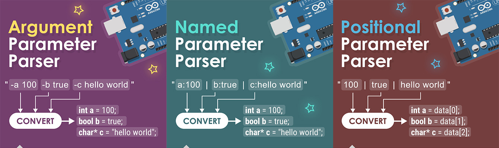

# Arduino Parameter Parser

Arduino Parameter Parser library allows you to parse formatted plain text. It generates data. Data types can be integer, boolean, float or string.  You can fetch data with name or index number. 



## Parser Types

`Argument Parameter Parser` Parses like `-a 15 -b true -c 3.14` plain text

`Named Parameter Parser` Parses like `int:15|bool:true|float:3.14` plain text

`Positional Parameter Parser` Parses like `15|true|3.14|hello world` plain text

## Argument Example

Firstly, you must define formatted plain text for named parameters. See example below

The "-" says us it's a name and comes "value" after space after name. It define "-name value".

```c++
// Define formatted plain text. 
String plainText = "-a 5 -b true -c 1.5 -d hello word";

// Define argumentParameters object and parse plain text.
ArgumentParameters argumentParameters = ArgumentParameters(plainText, 6);
// "6" value is limitter for capacity. This object just contains maximum 6 "-name value" pairs.
// You can increment it according to your requirement

// Get value of named "c" as float type.
// If named "c" key not exists then will return 0.5 value
Serial.println (namedParameters.asFloat("c", 0.5));
```


## Named Example

Firstly again, you must define formatted plain text for named parameters. See example below

The "|" is separator. It separates "name:value" pair. The ":" is divider. It divides name and value.

```c++
// Define formatted plain text. 
String plainText = "int:1|bool:true|float:3.14|string:hello world";

// Define namedParameters object and parse plain text.
NamedParameters namedParameters = NamedParameters(plainText, 6);
// "6" value is limitter for capacity. This object just contains maximum 6 name:value pairs.
// You can increment it according to your requirement

// Get value of named "float" key as float type.
// If named "float" key not exists then will return 0.5 value
Serial.println (namedParameters.asFloat("float", 0.5));
```


## Positional Example

Firstly again, you must define formatted plain text for positional parameters. See example below.

The "|" is separator. It separates positional values. Position order is "0|1|2|3|n". Every position can contain value any type.

```c++
// Define formatted plain text. 
String plainText = "1|true|3.14|hello world";

// Define namedParameters object and parse plain text
PositionalParameters positionalParameters = PositionalParameters(plainText, 6);

// Get value of "0" position as float type.
// If position "0" not exists then will return 0.5 value
Serial.println (namedParameters.asFloat(0, 0.5));
```


## Argument Function List

`void print ()` // prints size, count, data items etc.

`void clear ()` // clears data items

`void valuePrint (const char* name)` // prints value of "name"

`void parse (String text)` // parses plain text

`int asInt (const char* name, int ifNotValue)` // return value of "name" as integer type

`float asFloat (const char* name, float ifNotValue)` // return value of "name" as float type

`bool asBool (const char* name, bool ifNotValue)` // return value of "name" as boolean type

`String asString (const char* name, const char* ifNotValue)` // return value of "name" as String object

`const char* asCStr (const char* name, const char* ifNotValue)` // return value of "name" as char* type

`bool set (const char* name, const char* value)` // set value for "name". will return false when size-count == 0. that mean exceed size.

## Named Function List

`void print ()` // prints size, count, data items etc.

`void clear ()` // clears data items

`void valuePrint (const char* name)` // prints value of "name"

`void parse (String text)` // parses plain text

`int asInt (const char* name, int ifNotValue)` // return value of "name" as integer type

`float asFloat (const char* name, float ifNotValue)` // return value of "name" as float type

`bool asBool (const char* name, bool ifNotValue)` // return value of "name" as boolean type

`String asString (const char* name, const char* ifNotValue)` // return value of "name" as String object

`const char* asCStr (const char* name, const char* ifNotValue)` // return value of "name" as char* type

`bool set (const char* name, const char* value)` // set value for "name". will return false when size-count == 0. that mean exceed size.

## Positional Function List

`void print ()` // prints size, count, data items etc.

`void clear ()` // clears data items

`void valuePrint (int index)` // prints value of "index" position

`void parse (String text)` // parses plain text

`int asInt (int index, int ifNotValue)` // return value of "index" position as integer type

`float asFloat (int index, float ifNotValue)` // return value of "index" position as float type

`bool asBool (int index, bool ifNotValue)` // return value of "index" position as boolean type

`String asString (int index, const char* ifNotValue)` // return value of "index" position as String object

`const char* asCStr (int index, const char* ifNotValue)` // return value of "index" position as char* type

`bool set (int index, const char* value)` // set value for "index" position. will return false when size-count == 0. that mean exceed size.

## Author

Murat TAMCI aka THEMT

https://www.themt.co

## License

MIT License

Copyright (c) 2022 Murat TAMCI

Permission is hereby granted, free of charge, to any person obtaining a copy
of this software and associated documentation files (the "Software"), to deal
in the Software without restriction, including without limitation the rights
to use, copy, modify, merge, publish, distribute, sublicense, and/or sell
copies of the Software, and to permit persons to whom the Software is
furnished to do so, subject to the following conditions:

The above copyright notice and this permission notice shall be included in all
copies or substantial portions of the Software.

THE SOFTWARE IS PROVIDED "AS IS", WITHOUT WARRANTY OF ANY KIND, EXPRESS OR
IMPLIED, INCLUDING BUT NOT LIMITED TO THE WARRANTIES OF MERCHANTABILITY,
FITNESS FOR A PARTICULAR PURPOSE AND NON INFRINGEMENT. IN NO EVENT SHALL THE
AUTHORS OR COPYRIGHT HOLDERS BE LIABLE FOR ANY CLAIM, DAMAGES OR OTHER
LIABILITY, WHETHER IN AN ACTION OF CONTRACT, TORT OR OTHERWISE, ARISING FROM,
OUT OF OR IN CONNECTION WITH THE SOFTWARE OR THE USE OR OTHER DEALINGS IN THE
SOFTWARE.
